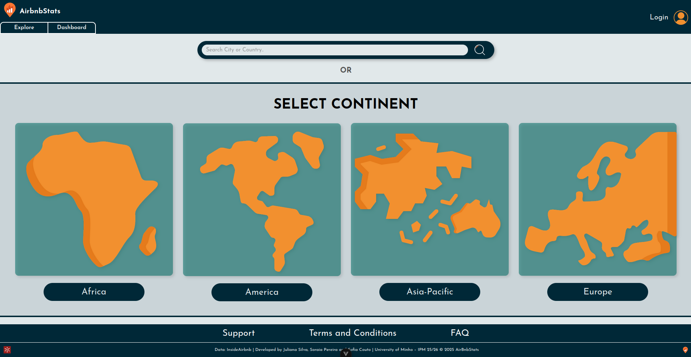

# InsideAirbnb Data Visualization

A web-based data visualization interface for **InsideAirbnb**, developed with a focus on usability, information visualization and user-centered interface design.

The project provides an interactive interface for exploring Airbnb-related data through a clear and accessible visual experience.



## Features

* Interactive data exploration
* Data visualization interface
* User-centered design
* Structured navigation and information presentation
* Local JSON-based backend for development and testing

## Running the Project

### 1. Install frontend dependencies

```bash
cd frontend
npm install
```

### 2. Start the backend

In another terminal:

```bash
cd backend
npx json-server db.json
```

### 3. Start the frontend

```bash
cd frontend
npm run dev
```


## Academic Context

Developed during the **2025/2026 academic year** as a **Human-Computer Interaction** project.

The project focuses on interface design, usability and effective presentation of data using the InsideAirbnb platform as its application domain.
